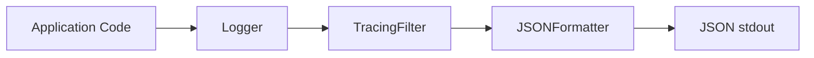

# Logging

This backend uses structured JSON logging with OpenTelemetry trace context injection and sensitive data
sanitization. The goal is logs that are both secure against injection attacks and easy to query in aggregation systems
like Elasticsearch or Loki.

## Architecture



## How it's wired

The logger is created once during application startup via dependency injection. The
[`setup_logger`](https://github.com/HardMax71/Integr8sCode/blob/main/backend/app/core/logging.py) function configures a
JSON formatter and attaches a filter for OpenTelemetry trace context:

```python
--8<-- "backend/app/core/logging.py:setup_logger"
```

The JSON formatter does two things beyond basic formatting. First, it injects context that would be tedious to pass
manually—the trace and span IDs from OpenTelemetry, and request metadata like method and path. Second, it sanitizes
sensitive data by pattern-matching things like API keys, JWT tokens, and database URLs:

```python
--8<-- "backend/app/core/logging.py:log_processors"
```

## Structured logging

All log calls pass structured data as keyword arguments rather than interpolating values into the message string. The message itself is a static string that describes what happened; the details go in keyword args where they become separate top-level JSON fields.

```python
# This is how logging looks throughout the codebase
self.logger.info(
    "Event deleted by admin",
    event_id=event_id,
    admin_email=admin.email,
    event_type=result.event_type,
)
```

The reason for this pattern is partly about queryability - log aggregators can index the `event_id` field separately and let you filter on it - but mostly about security. When you interpolate user-controlled data into a log message, you open the door to log injection attacks.

## Log injection

Log injection is what happens when an attacker crafts input that corrupts your log output. The classic attack looks like this: a user submits an event ID containing a newline and a fake log entry.

```python
# Attacker submits this as event_id
event_id = "abc123\n[CRITICAL] System compromised - contact security@evil.com"

# If you log it directly in the message...
logger.warning(f"Processing event {event_id}")

# Your log output now contains a forged critical alert
```

The fix is to keep user data out of the message string entirely. When you pass it as a keyword argument, the JSON renderer escapes special characters, and the malicious content becomes a harmless string value rather than a log line injection.

The codebase treats these as user-controlled and passes them as keyword args: path parameters like execution_id or saga_id,
query parameters, request body fields, Kafka message content, database results derived from user input, and exception
messages (which often contain user data).

## What gets logged

Trace IDs are injected automatically by the OTel filter:

| Field            | Source                          | Purpose                           |
|------------------|---------------------------------|-----------------------------------|
| `trace_id`       | OpenTelemetry                   | Link to distributed traces        |
| `span_id`        | OpenTelemetry                   | Link to specific span             |
| `request_method` | HTTP request                    | GET, POST, etc.                   |
| `request_path`   | HTTP request                    | API endpoint path                 |
| `client_host`    | HTTP request                    | Client IP address                 |

For domain-specific context, developers add keyword arguments based on what operation they're logging. The pattern is
consistent: the message says what happened, the keyword args say to what and by whom.

## Practical use

When something goes wrong, start by filtering logs by `trace_id` to see everything that happened during that
request. Use the `trace_id` to view the full distributed trace in your tracing backend (e.g. Tempo, or any
OTLP-compatible collector configured via `OTLP_TRACES_ENDPOINT` in settings).

| Log Level | Use case                                                    |
|-----------|-------------------------------------------------------------|
| DEBUG     | Detailed diagnostics (noisy, local debugging only)          |
| INFO      | Normal operations (started, completed, processed)           |
| WARNING   | Recoverable issues                                          |
| ERROR     | Failures requiring attention                                |

The log level is controlled by the `LOG_LEVEL` setting in `config.toml`.

## Key files

| File                                                                                                       | Purpose                              |
|------------------------------------------------------------------------------------------------------------|--------------------------------------|
| [`core/logging.py`](https://github.com/HardMax71/Integr8sCode/blob/main/backend/app/core/logging.py)       | Logger setup, filters, JSON formatter|
