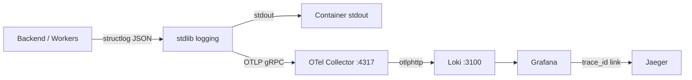

# Log Aggregation (Loki)

Loki collects structured JSON logs from the backend and all workers so you can search, filter and correlate them with traces in Grafana. Without it the logs only live on container stdout — useful for `docker logs` but not for querying across services or time ranges.

## Architecture



Each Python process (the FastAPI backend and all six workers) emits structured JSON logs via structlog. The `setup_log_exporter` function attaches an OpenTelemetry `LoggingHandler` to stdlib logging, which forwards log records over OTLP gRPC to the OTel Collector. The collector then pushes them to Loki via its native OTLP HTTP endpoint (`/otlp/v1/logs`). Logs still go to stdout as before — the OTLP path is additive.

## How it's wired

### Python side

The log exporter is initialized once per process, right after `setup_logger`. The backend calls it in `create_app`, and each worker calls it in its `main()`:

```python
--8<-- "backend/app/core/logging.py:setup_logger"
```

The exporter follows the same guard pattern as `setup_metrics`: skipped when `TESTING` is true or when `OTEL_EXPORTER_OTLP_ENDPOINT` is empty. In those cases stdlib logging still works, it just doesn't ship anywhere.

### OTel Collector

The collector receives OTLP logs on `:4317` (same endpoint used for traces and metrics), runs them through the `resource` and `attributes` processors to attach `service.name` and `service.namespace` labels, then exports to Loki:

```yaml
exporters:
  otlphttp/loki:
    endpoint: http://loki:3100/otlp
    tls:
      insecure: true
```

Loki 3.x natively accepts OTLP at `/otlp/v1/logs`. Resource attributes (`service.name`, `service.namespace`) become index labels. OTLP `trace_id` and `span_id` become structured metadata, which is what enables the log-to-trace linking in Grafana.

### Loki

Loki runs as a single instance with filesystem storage:

```yaml
--8<-- "backend/loki/loki-config.yaml"
```

Key settings:

| Setting | Value | Why |
|---------|-------|-----|
| `allow_structured_metadata` | `true` | Required for OTLP ingestion — stores `trace_id`, `span_id`, `service.name` as structured metadata |
| `schema: v13` + `store: tsdb` | — | Modern Loki 3.x defaults, required for structured metadata support |
| `retention_period` | `720h` (30 days) | Matches Victoria Metrics retention |
| `auth_enabled` | `false` | Internal Docker network only |

### Grafana datasource

Loki is provisioned as a datasource with a derived field that parses `trace_id` from the JSON log body and links to Jaeger:

```yaml
- name: Loki
  type: loki
  uid: loki
  access: proxy
  url: http://loki:3100
  editable: true
  jsonData:
    derivedFields:
      - datasourceUid: jaeger
        matcherRegex: '"trace_id":"(\w+)"'
        name: TraceID
        url: '$${__value.raw}'
```

This means any log line containing a `trace_id` field gets a clickable link to the corresponding Jaeger trace.

## Practical use

Open Grafana Explore (`http://localhost:3000/explore`), select the Loki datasource, and run LogQL queries:

```logql
# All logs from the saga orchestrator
{service_name="integr8scode-saga-orchestrator"}

# Errors across all services
{service_namespace="integr8scode"} |= `"level":"error"`

# Logs for a specific execution
{service_namespace="integr8scode"} | json | execution_id="abc123"

# Logs correlated with a trace
{service_namespace="integr8scode"} | json | trace_id="0af7651916cd43dd8448eb211c80319c"
```

When you find an interesting log line, click the TraceID link to jump to the full distributed trace in Jaeger. This works in the other direction too — from a Jaeger trace you can switch to Loki and filter by the same `trace_id` to see all logs emitted during that trace.

## Docker Compose

Loki runs under the `observability` profile alongside Grafana, Jaeger, and Victoria Metrics:

```bash
docker compose --profile observability up
```

The container has a 256 MiB memory limit and stores data in the `loki_data` volume. The OTel Collector and Grafana both depend on Loki being healthy before they start.

| Port | Binding | Purpose |
|------|---------|---------|
| 3100 | `127.0.0.1:3100` | HTTP API and OTLP ingestion |

## Key files

| File | Purpose |
|------|---------|
| [`loki/loki-config.yaml`](https://github.com/HardMax71/Integr8sCode/blob/main/backend/loki/loki-config.yaml) | Loki server configuration |
| [`otel-collector-config.yaml`](https://github.com/HardMax71/Integr8sCode/blob/main/backend/otel-collector-config.yaml) | Collector pipeline with `otlphttp/loki` exporter |
| [`grafana/provisioning/datasources/datasources.yml`](https://github.com/HardMax71/Integr8sCode/blob/main/backend/grafana/provisioning/datasources/datasources.yml) | Loki datasource with trace linking |
| [`core/logging.py`](https://github.com/HardMax71/Integr8sCode/blob/main/backend/app/core/logging.py) | `setup_log_exporter` — OTLP log export initialization |
