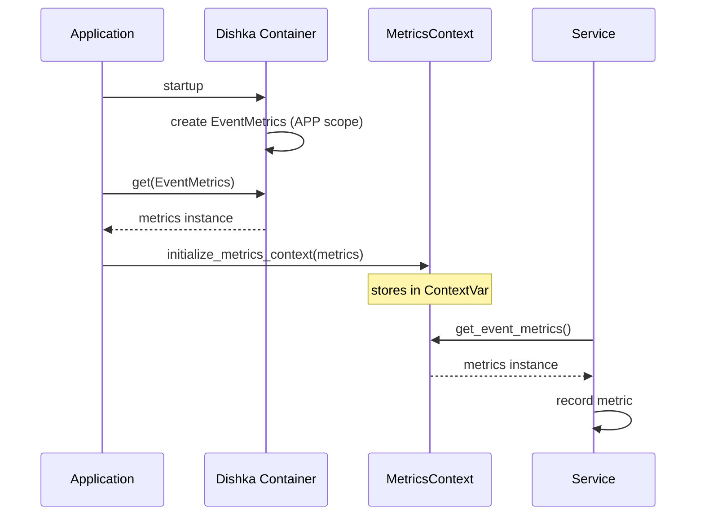

# Metrics context variables

## The problem

Metrics needed to be available everywhere, but passing them through every function call would pollute interfaces. The EventMetrics class was using a singleton pattern, which worked but had several issues. Singletons are essentially global state in disguise, they make testing harder because you can't easily mock them, and they bypass the dependency injection system entirely.

The real issue became apparent with classes like EventBuffer, UnifiedProducer, and various services. These components live deep in the infrastructure layer where dependency injection isn't always practical. They were creating their own metrics instances with `EventMetrics()`, which only worked because of the singleton pattern. This created a hidden dependency that wasn't obvious from the code.

## Context variables

Python's contextvars module, introduced in Python 3.7, provides a solution that's specifically designed for this kind of problem. Context variables are like thread-local storage but designed for async/await code. When you set a value in a context variable, it's automatically available to all code running in that async context, including across await boundaries.

Think of it like ambient context that flows through your async call stack. When you make an async call, the context is copied to the new task, so each task has its own view of the context that doesn't interfere with others. This is perfect for things like request IDs, user context, and yes, metrics collectors.

## Implementation

The implementation centers around the `app/core/metrics/context.py` module. Instead of making each metrics class a singleton, normal instances are created through dependency injection and placed in context variables during application startup.

The flow works like this: during application startup, the Dishka container creates all the metrics instances as APP-scoped singletons. These are proper instances managed by the DI container. Then, in the lifespan function, `initialize_metrics_context` is called to retrieve these instances from the container and store them in context variables.



Once the metrics are in context, any code can access them using simple getter functions like `get_event_metrics()`. This works anywhere in the codebase — in services, repositories, event handlers, or deep infrastructure code. The metrics are ambient but not global; they're scoped to the async context.

## Details

The MetricsContext class manages a registry of context variables, one for each metric type. Each context variable is wrapped in a MetricsContextVar generic class that provides type safety and lazy initialization. If you call `get_event_metrics()` and no metric has been set in the context (like during testing or in a standalone script), it will create one on the fly.

This lazy initialization is crucial for testing. You can write a test that uses a service which internally uses metrics, and it will just work without any special setup. If you want to verify metric calls, you can initialize the context with a mock metrics instance, and all code in that test will use your mock.

The context variables themselves are created lazily when first accessed to avoid circular import issues. Since many metric classes might import from various parts of the codebase, the imports are deferred until the registry is actually needed.

## Benefits

This approach gives the best of both worlds. Metrics are available everywhere without explicitly passing them, but the problems of true global state are avoided. Each async context (like a request or a background task) has its own view of the metrics, though in practice they all share the same instances that were created at startup.

Testing becomes much cleaner. Instead of trying to mock a singleton or mess with module-level state, you just initialize the context with mock metrics for your test. When the test ends, the context is automatically cleaned up. Different tests can run in parallel without interfering with each other because each has its own context.

The code is also more honest about its dependencies. When you see `get_event_metrics()` in a function, you know it uses metrics. With the singleton pattern, the dependency was hidden inside the class constructor. Now it's explicit at the point of use.

## Usage

For most developers, using the metrics system is straightforward. If you're writing a service or repository that needs metrics, you import the appropriate getter function and call it:

```python
from app.core.metrics.context import get_event_metrics

class MyService:
    def __init__(self):
        self.metrics = get_event_metrics()
```

You don't need to worry about initialization or lifecycle; that's handled by the framework during startup. The metrics instance you get is the same one everyone else gets (within the same async context), properly configured and ready to use.

If you're writing tests, you have two options. For integration tests where you want real metrics, you don't need to do anything special - the lazy initialization will create them as needed. For unit tests where you want to verify metric calls, you can set up mocks:

```python
from app.core.metrics.context import MetricsContext

def test_my_service():
    mock_metrics = Mock(spec=EventMetrics)
    MetricsContext.initialize_all(event=mock_metrics)
    
    # Your test code here
    service = MyService()
    service.do_something()
    
    # Verify metrics were called
    mock_metrics.record_event_published.assert_called_once()
    
    # Clean up for other tests
    MetricsContext.reset_all()
```

## Bigger picture

This pattern isn't just about metrics. It's the same approach that OpenTelemetry uses for context propagation, which is becoming a standard pattern in the Python ecosystem. The same technique could be applied to other cross-cutting concerns like feature flags, audit logging, or user context.

The key insight is that contextvars provides a middle ground between explicit parameter passing and global state. It's particularly well-suited for observability and infrastructure concerns that need to be available throughout the call stack but shouldn't pollute business logic interfaces.

This pattern makes the metrics system more testable, more maintainable, and more aligned with modern Python practices, all while keeping the developer experience simple and intuitive.