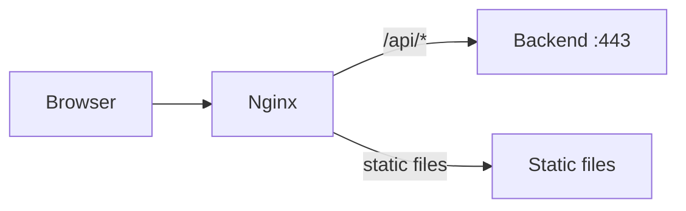

# Nginx configuration

The frontend uses Nginx as a reverse proxy and static file server. The configuration lives in
[`frontend/nginx.conf.template`](https://github.com/HardMax71/Integr8sCode/blob/main/frontend/nginx.conf.template).

## Architecture



Nginx serves two purposes: static file server for the Svelte frontend build, and reverse proxy for API requests to the
backend.

## Configuration breakdown

### Server block

```nginx
--8<-- "frontend/nginx.conf.template:1:6"
```

| Directive       | Purpose                                          |
|-----------------|--------------------------------------------------|
| `listen 5001`   | Internal container port (mapped via Docker Compose) |
| `server_name _` | Catch-all server name                            |
| `root`          | Static files from Svelte build                   |

### Compression

```nginx
--8<-- "frontend/nginx.conf.template:8:13"
```

Gzip compression reduces bandwidth for text-based assets. Binary files (images, fonts) are excluded as they're already
compressed.

### API proxy

```nginx
--8<-- "frontend/nginx.conf.template:15:25"
```

| Directive              | Purpose                                          |
|------------------------|--------------------------------------------------|
| `proxy_pass`           | Forward to backend service over HTTPS            |
| `proxy_ssl_verify off` | Skip certificate verification (internal traffic) |
| `X-Real-IP`            | Pass client IP to backend for rate limiting      |
| `X-Forwarded-Proto`    | Preserve original protocol for redirect URLs     |
| `Cookie`               | Forward authentication cookies                   |

### SSE (Server-Sent Events)

SSE endpoints require special handling to prevent buffering:

```nginx
--8<-- "frontend/nginx.conf.template:27:54"
```

| Directive                   | Purpose                                           |
|-----------------------------|---------------------------------------------------|
| `Connection ''`             | Disable connection header for HTTP/1.1 keep-alive |
| `proxy_http_version 1.1`    | Required for chunked transfer encoding            |
| `proxy_buffering off`       | Stream responses immediately                      |
| `proxy_read_timeout 86400s` | 24-hour timeout for long-lived connections        |
| `X-Accel-Buffering no`      | Disable upstream buffering                        |

Without these settings, SSE events would be buffered and delivered in batches instead of real-time.

### Static asset caching

```nginx
--8<-- "frontend/nginx.conf.template:57:75"
```

Svelte build outputs hashed filenames (`app.abc123.js`), making them safe to cache indefinitely. HTML files must never
be cached to ensure users get the latest asset references.

### Security headers

```nginx
--8<-- "frontend/nginx.conf.template:77:84"
```

#### Content Security Policy

| Directive         | Value                    | Purpose                             |
|-------------------|--------------------------|-------------------------------------|
| `default-src`     | `'self'`                 | Fallback for unspecified directives |
| `script-src`      | `'self' 'unsafe-inline'` | Allow inline scripts (Svelte)       |
| `style-src`       | `'self' 'unsafe-inline'` | Allow inline styles (Svelte)        |
| `img-src`         | `'self' data: blob:`     | Allow data: URLs for SVG icons      |
| `font-src`        | `'self' data:`           | Allow embedded fonts                |
| `object-src`      | `'none'`                 | Block plugins (Flash, Java)         |
| `frame-ancestors` | `'none'`                 | Prevent clickjacking                |
| `connect-src`     | `'self'`                 | XHR/fetch/WebSocket same-origin     |

The `data:` source is required for the Monaco editor's inline SVG icons.

#### Other security headers

| Header                   | Value                             | Purpose                        |
|--------------------------|-----------------------------------|--------------------------------|
| `X-Frame-Options`        | `SAMEORIGIN`                      | Legacy clickjacking protection |
| `X-Content-Type-Options` | `nosniff`                         | Prevent MIME sniffing          |
| `Referrer-Policy`        | `strict-origin-when-cross-origin` | Limit referrer leakage         |
| `Permissions-Policy`     | Deny geolocation, mic, camera     | Disable unused APIs            |

### SPA routing

The `try_files $uri $uri/ /index.html` directive enables client-side routing. When a URL like `/editor` is requested
directly, Nginx serves `index.html` and lets the Svelte router handle the path.

## Deployment

The nginx configuration uses environment variable substitution via the official nginx Docker image's built-in `envsubst`
feature:

```dockerfile
--8<-- "frontend/Dockerfile.prod:12:21"
```

The nginx image automatically processes files in `/etc/nginx/templates/*.template` and outputs the result to
`/etc/nginx/conf.d/` with the `.template` suffix removed.

### Environment variables

| Variable      | Purpose                           | Example               |
|---------------|-----------------------------------|-----------------------|
| `BACKEND_URL` | Backend service URL for API proxy | `https://backend:443` |

Set this via the docker-compose environment section.

### Rebuilding

To apply nginx configuration changes:

```bash
docker compose build --no-cache frontend
docker compose restart frontend
```

## Troubleshooting

| Issue                    | Cause                            | Solution                                  |
|--------------------------|----------------------------------|-------------------------------------------|
| SSE connections dropping | Default 60s `proxy_read_timeout` | Verify 86400s timeout is set              |
| CSP blocking resources   | Missing source in directive      | Check browser console, add blocked source |
| 502 Bad Gateway          | Backend unreachable              | `docker compose logs backend`             |
| Assets not updating      | Browser cache                    | Clear cache or verify `no-cache` on HTML  |
