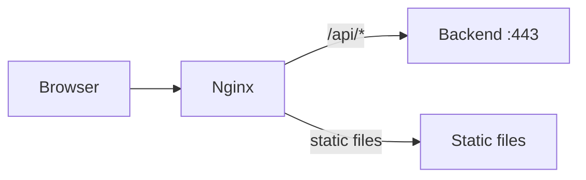

# Nginx configuration

The frontend uses Nginx as a reverse proxy and static file server. The configuration lives in
[`frontend/nginx.conf.template`](https://github.com/HardMax71/Integr8sCode/blob/main/frontend/nginx.conf.template).

## Architecture



Nginx serves two purposes: static file server for the Svelte frontend build, and reverse proxy for API requests to the
backend.

## Configuration breakdown

### Server block

```nginx
--8<-- "frontend/nginx.conf.template:server_block"
```

| Directive       | Purpose                                          |
|-----------------|--------------------------------------------------|
| `listen 5001`   | Internal container port (mapped via Docker Compose) |
| `server_name _` | Catch-all server name                            |
| `root`          | Static files from Svelte build                   |

### Compression

```nginx
--8<-- "frontend/nginx.conf.template:compression"
```

Gzip compression reduces bandwidth for text-based assets. Binary files (images, fonts) are excluded as they're already
compressed.

| Directive        | Value                     | Purpose                                                           |
|------------------|---------------------------|-------------------------------------------------------------------|
| `gzip on`        |                           | Enable gzip compression globally                                  |
| `gzip_vary`      | `on`                      | Add `Vary: Accept-Encoding` header so caches store both versions  |
| `gzip_min_length` | `1024`                   | Skip compression for responses under 1 KB (overhead not worth it) |
| `gzip_types`     | text/css, application/json, ... | MIME types to compress (text-based only, not images/video) |
| `gzip_disable`   | `"msie6"`                 | Disable for IE6 which mishandles gzipped responses                |

### API proxy

```nginx
--8<-- "frontend/nginx.conf.template:api_proxy"
```

| Directive                      | Purpose                                                                      |
|--------------------------------|------------------------------------------------------------------------------|
| `proxy_pass ${BACKEND_URL}`    | Forward requests to the backend; the variable is replaced by `envsubst` at container start |
| `proxy_ssl_verify off`         | Skip TLS certificate verification — safe because this is container-to-container traffic on an internal Docker network. **Never use this when proxying to external or untrusted backends** — it disables certificate validation entirely, making the connection vulnerable to MITM attacks |
| `proxy_set_header Host $host`  | Forward the original `Host` header so the backend sees the client's requested hostname |
| `proxy_set_header X-Real-IP`   | Pass the client's real IP address for rate limiting and audit logging         |
| `proxy_set_header X-Forwarded-For` | Append client IP to the proxy chain header (standard for multi-layer proxies) |
| `proxy_set_header X-Forwarded-Proto` | Preserve the original protocol (`http`/`https`) so the backend can build correct redirect URLs |
| `proxy_pass_request_headers on` | Forward all client request headers to the backend (default, made explicit for clarity) |
| `proxy_set_header Cookie`      | Forward authentication cookies (`access_token`, `csrf_token`) to the backend |

### SSE (Server-Sent Events)

SSE endpoints require special handling to prevent buffering:

```nginx
--8<-- "frontend/nginx.conf.template:sse_proxy"
```

| Directive                            | Purpose                                                                                   |
|--------------------------------------|-------------------------------------------------------------------------------------------|
| `proxy_set_header Connection ''`     | Clear the `Connection` header so nginx doesn't inject `close` — required for HTTP/1.1 keep-alive streaming |
| `proxy_http_version 1.1`            | Use HTTP/1.1 between nginx and the backend, which supports chunked transfer encoding needed by SSE |
| `proxy_buffering off`               | Disable response buffering — pass each chunk from the backend to the client immediately    |
| `proxy_cache off`                   | Disable response caching — SSE streams must never be served from cache                      |
| `proxy_read_timeout 86400s`         | 24-hour read timeout — SSE connections are long-lived; the default 60s would close them     |
| `proxy_send_timeout 86400s`         | 24-hour send timeout — matches read timeout to prevent asymmetric timeout disconnects       |
| `proxy_set_header X-Accel-Buffering no` | Tell nginx's upstream module to disable buffering (belt-and-suspenders with `proxy_buffering off`) |

Without these settings, SSE events would be buffered and delivered in batches instead of real-time.

This location block is nested inside `location /api/` using a regex match (`~ ^/api/v1/events/`). Nesting is used here
so that the SSE location inherits the parent's `proxy_pass` context while adding stream-specific directives. Because
the SSE block defines its own `proxy_set_header` directives (e.g., `Connection ''`, `X-Accel-Buffering no`), it must
redeclare all of them — `proxy_set_header` follows the same all-or-nothing inheritance as `add_header`: once a child
block defines **any** `proxy_set_header`, all parent-level `proxy_set_header` directives are dropped for that block.

### Static asset caching

```nginx
--8<-- "frontend/nginx.conf.template:static_caching"
```

| Location pattern                   | `expires` value | Effect                                                                |
|------------------------------------|-----------------|-----------------------------------------------------------------------|
| `~* \.(js\|css\|png\|...)`         | `1y`            | Sets `Cache-Control: max-age=31536000` — browser caches for one year  |
| `/build/`                          | `1y`            | Same treatment for the Svelte build output directory                  |
| `~* \.html$`                       | `-1`            | Sets `Cache-Control: no-cache` — browser must revalidate every time   |

Svelte build outputs hashed filenames (`app.abc123.js`), making them safe to cache indefinitely. HTML files must never
be cached to ensure users get the latest asset references.

The `~*` modifier makes the regex case-insensitive (matches `.JS`, `.Css`, etc.).

### Security headers

```nginx
--8<-- "frontend/nginx.conf.template:security_headers"
```

All security headers are defined at the `server` level so they apply to every response. See
[`add_header` inheritance](#add_header-inheritance) for why no location block in this config uses `add_header`.

#### Content Security Policy

| Directive         | Value                    | Purpose                             |
|-------------------|--------------------------|-------------------------------------|
| `default-src`     | `'self'`                 | Fallback for unspecified directives |
| `script-src`      | `'self' 'unsafe-inline'` | Allow inline scripts (Svelte)       |
| `style-src`       | `'self' 'unsafe-inline'` | Allow inline styles (Svelte)        |
| `img-src`         | `'self' data: blob:`     | Allow data: URLs for SVG icons      |
| `font-src`        | `'self' data:`           | Allow embedded fonts                |
| `object-src`      | `'none'`                 | Block plugins (Flash, Java)         |
| `frame-ancestors` | `'none'`                 | Prevent clickjacking                |
| `connect-src`     | `'self'`                 | XHR/fetch/WebSocket same-origin     |

The `data:` source is required for the Monaco editor's inline SVG icons.

`'unsafe-inline'` for `script-src` and `style-src` weakens CSP protection against XSS attacks, since it allows any
inline `<script>` or `<style>` tag to execute. This is a trade-off for Svelte compatibility — the framework injects
inline styles at runtime, and the build output includes inline scripts. Migrating to nonce-based CSP
(`'nonce-<random>'`) would eliminate this trade-off but requires coordinating nonce generation between nginx and the
backend.

#### Other security headers

| Header                   | Value                             | Purpose                        |
|--------------------------|-----------------------------------|--------------------------------|
| `X-Frame-Options`        | `DENY`                            | Legacy clickjacking protection (aligns with CSP `frame-ancestors 'none'`) |
| `X-Content-Type-Options` | `nosniff`                         | Prevent MIME sniffing          |
| `Referrer-Policy`        | `strict-origin-when-cross-origin` | Limit referrer leakage         |
| `Permissions-Policy`     | Deny geolocation, mic, camera     | Disable unused APIs            |

### SPA routing

The `try_files $uri $uri/ /index.html` directive enables client-side routing. When a URL like `/editor` is requested
directly, Nginx serves `index.html` and lets the Svelte router handle the path.

## `add_header` inheritance

Nginx has a critical inheritance rule: if **any** `add_header` directive appears inside a `location` block, **all**
`add_header` directives from the parent `server` block are silently dropped for that location. This is an all-or-nothing
behavior — there is no merging.

```nginx
# BAD — security headers NOT sent for /api/v1/events/ responses
server {
    add_header X-Frame-Options "DENY";                 # defined at server level

    location ~ ^/api/v1/events/ {
        add_header Cache-Control "no-cache";           # this single add_header
                                                       # drops ALL server-level headers
    }
}
```

```nginx
# GOOD — security headers sent for all responses including SSE
server {
    add_header X-Frame-Options "DENY";                 # defined at server level

    location ~ ^/api/v1/events/ {
        proxy_buffering off;                           # no add_header here,
                                                       # server-level headers inherit
    }
}
```

This config intentionally avoids `add_header` in every `location` block so that the five security headers defined at
the `server` level apply uniformly to all responses:

| Location                       | Has `add_header`? | Security headers inherited? |
|--------------------------------|-------------------|-----------------------------|
| `location /api/`               | No                | Yes                         |
| `location ~ ^/api/v1/events/` | No                | Yes                         |
| `location ~* \.(js\|css\|…)`  | No                | Yes                         |
| `location /build/`             | No                | Yes                         |
| `location ~* \.html$`         | No                | Yes                         |
| `location /`                   | No                | Yes                         |

!!! warning "Adding `add_header` to a location"
    If you need to add a response header in a specific location, you must **repeat all five security headers** in that
    same block, or use the `always` parameter with an `include` file. Prefer solving the problem without `add_header`
    when possible (e.g., use `proxy_set_header` for upstream-facing headers, or let the backend set its own response
    headers).

### `proxy_set_header` vs `add_header`

These two directives are often confused but serve different purposes:

| Directive          | Direction         | Affects                            |
|--------------------|-------------------|------------------------------------|
| `proxy_set_header` | nginx → backend   | Modifies request headers sent to the upstream server |
| `add_header`       | nginx → client    | Adds response headers sent to the browser            |

`proxy_set_header` has its own inheritance rules (also all-or-nothing per block), but it does not interact with
`add_header` inheritance. The SSE block uses `proxy_set_header X-Accel-Buffering no` to tell nginx's upstream module
to disable buffering — this is a request-direction header and does not trigger the `add_header` inheritance problem.

## Deployment

The nginx configuration uses environment variable substitution via the official nginx Docker image's built-in `envsubst`
feature:

```dockerfile
--8<-- "frontend/Dockerfile.prod:production_stage"
```

The nginx image automatically processes files in `/etc/nginx/templates/*.template` and outputs the result to
`/etc/nginx/conf.d/` with the `.template` suffix removed.

### Environment variables

| Variable      | Purpose                           | Example               |
|---------------|-----------------------------------|-----------------------|
| `BACKEND_URL` | Backend service URL for API proxy | `https://backend:443` |

Set this via the docker-compose environment section.

### Rebuilding

To apply nginx configuration changes:

```bash
docker compose build --no-cache frontend
docker compose restart frontend
```

## Troubleshooting

| Issue                           | Cause                            | Solution                                                                 |
|---------------------------------|----------------------------------|--------------------------------------------------------------------------|
| SSE connections dropping        | Default 60s `proxy_read_timeout` | Verify 86400s timeout is set                                             |
| CSP blocking resources          | Missing source in directive      | Check browser console, add blocked source                                |
| 502 Bad Gateway                 | Backend unreachable              | `docker compose logs backend`                                            |
| Assets not updating             | Browser cache                    | Clear cache or verify `no-cache` on HTML                                 |
| Security headers missing on SSE | `add_header` in location block   | Remove `add_header` from the location; see [`add_header` inheritance](#add_header-inheritance) |
| Security headers missing on some routes | Same inheritance issue  | Verify no location block has `add_header`; use `curl -I` to check        |
