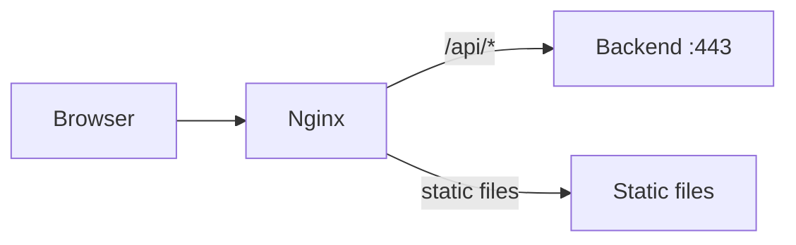

# Nginx Configuration

The frontend uses Nginx as a reverse proxy and static file server. This document explains the configuration in
`frontend/nginx.conf`.

## Architecture



Nginx serves two purposes:

1. **Static file server** for the Svelte frontend build
2. **Reverse proxy** for API requests to the backend

## Configuration Breakdown

### Server Block

```nginx
server {
    listen 5001;
    server_name _;
    root /usr/share/nginx/html;
    index index.html;
}
```

| Directive       | Purpose                                          |
|-----------------|--------------------------------------------------|
| `listen 5001`   | Internal container port (mapped via K8s Service) |
| `server_name _` | Catch-all server name                            |
| `root`          | Static files from Svelte build                   |

### Compression

```nginx
gzip on;
gzip_vary on;
gzip_min_length 1024;
gzip_types text/plain text/css text/xml text/javascript
           application/javascript application/xml+rss
           application/json application/x-font-ttf
           font/opentype image/svg+xml image/x-icon;
```

Gzip compression reduces bandwidth for text-based assets. Binary files (images, fonts) are excluded as they're already
compressed.

### API Proxy

```nginx
location /api/ {
    proxy_pass https://backend:443;
    proxy_ssl_verify off;
    proxy_set_header Host $host;
    proxy_set_header X-Real-IP $remote_addr;
    proxy_set_header X-Forwarded-For $proxy_add_x_forwarded_for;
    proxy_set_header X-Forwarded-Proto $scheme;
    proxy_pass_request_headers on;
    proxy_set_header Cookie $http_cookie;
}
```

| Directive              | Purpose                                          |
|------------------------|--------------------------------------------------|
| `proxy_pass`           | Forward to backend service over HTTPS            |
| `proxy_ssl_verify off` | Skip certificate verification (internal traffic) |
| `X-Real-IP`            | Pass client IP to backend for rate limiting      |
| `X-Forwarded-Proto`    | Preserve original protocol for redirect URLs     |
| `Cookie`               | Forward authentication cookies                   |

### SSE (Server-Sent Events)

SSE endpoints require special handling to prevent buffering:

```nginx
location ~ ^/api/v1/events/ {
    proxy_pass https://backend:443;
    proxy_ssl_verify off;

    # SSE-specific settings
    proxy_set_header Connection '';
    proxy_http_version 1.1;
    proxy_buffering off;
    proxy_cache off;
    proxy_read_timeout 86400s;
    proxy_send_timeout 86400s;
    proxy_set_header X-Accel-Buffering no;
}
```

| Directive                   | Purpose                                           |
|-----------------------------|---------------------------------------------------|
| `Connection ''`             | Disable connection header for HTTP/1.1 keep-alive |
| `proxy_http_version 1.1`    | Required for chunked transfer encoding            |
| `proxy_buffering off`       | Stream responses immediately                      |
| `proxy_read_timeout 86400s` | 24-hour timeout for long-lived connections        |
| `X-Accel-Buffering no`      | Disable upstream buffering                        |

Without these settings, SSE events would be buffered and delivered in batches instead of real-time.

### Static Asset Caching

```nginx
# Immutable assets (hashed filenames)
location ~* \.(js|css|png|jpg|jpeg|gif|ico|svg|woff|woff2|ttf|eot)$ {
    expires 1y;
    add_header Cache-Control "public, immutable";
}

# Build directory
location /build/ {
    expires 1y;
    add_header Cache-Control "public, max-age=31536000, immutable";
}

# HTML (never cache)
location ~* \.html$ {
    expires -1;
    add_header Cache-Control "no-store, no-cache, must-revalidate";
}
```

Svelte build outputs hashed filenames (`app.abc123.js`), making them safe to cache indefinitely. HTML files must never
be cached to ensure users get the latest asset references.

### Security Headers

```nginx
location / {
    add_header Content-Security-Policy "...";
    add_header X-Frame-Options "SAMEORIGIN";
    add_header X-Content-Type-Options "nosniff";
    add_header Referrer-Policy "strict-origin-when-cross-origin";
    add_header Permissions-Policy "geolocation=(), microphone=(), camera=()";
    try_files $uri $uri/ /index.html;
}
```

#### Content Security Policy

```nginx
Content-Security-Policy "
    default-src 'self';
    script-src 'self' 'unsafe-inline';
    style-src 'self' 'unsafe-inline';
    img-src 'self' data: blob:;
    font-src 'self' data:;
    object-src 'none';
    base-uri 'self';
    form-action 'self';
    frame-ancestors 'none';
    connect-src 'self';
"
```

| Directive         | Value                    | Purpose                             |
|-------------------|--------------------------|-------------------------------------|
| `default-src`     | `'self'`                 | Fallback for unspecified directives |
| `script-src`      | `'self' 'unsafe-inline'` | Allow inline scripts (Svelte)       |
| `style-src`       | `'self' 'unsafe-inline'` | Allow inline styles (Svelte)        |
| `img-src`         | `'self' data: blob:`     | Allow data: URLs for SVG icons      |
| `font-src`        | `'self' data:`           | Allow embedded fonts                |
| `object-src`      | `'none'`                 | Block plugins (Flash, Java)         |
| `frame-ancestors` | `'none'`                 | Prevent clickjacking                |
| `connect-src`     | `'self'`                 | XHR/fetch/WebSocket same-origin     |

The `data:` source is required for the Monaco editor's inline SVG icons.

#### Other Security Headers

| Header                   | Value                             | Purpose                        |
|--------------------------|-----------------------------------|--------------------------------|
| `X-Frame-Options`        | `SAMEORIGIN`                      | Legacy clickjacking protection |
| `X-Content-Type-Options` | `nosniff`                         | Prevent MIME sniffing          |
| `Referrer-Policy`        | `strict-origin-when-cross-origin` | Limit referrer leakage         |
| `Permissions-Policy`     | Deny geolocation, mic, camera     | Disable unused APIs            |

### SPA Routing

```nginx
try_files $uri $uri/ /index.html;
```

This directive enables client-side routing. When a URL like `/editor` is requested directly, Nginx serves `index.html`
and lets the Svelte router handle the path.

## Deployment

The nginx.conf is copied into the container during build:

```dockerfile
# frontend/Dockerfile.prod
FROM nginx:alpine
COPY --from=builder /app/public /usr/share/nginx/html
COPY nginx.conf /etc/nginx/conf.d/default.conf
```

To apply changes:

```bash
docker build --no-cache -t integr8scode-frontend:latest \
  -f frontend/Dockerfile.prod frontend/
kubectl rollout restart deployment/frontend -n integr8scode
```

## Troubleshooting

### SSE connections dropping

Check `proxy_read_timeout`. Default is 60s which will close idle SSE connections.

### CSP blocking resources

Check browser console for CSP violation reports. Add the blocked source to the appropriate directive.

### 502 Bad Gateway

Backend service is unreachable. Verify:

```bash
kubectl get svc backend -n integr8scode
kubectl logs -n integr8scode deployment/frontend
```

### Assets not updating

Clear browser cache or add cache-busting query parameters. Verify HTML files have `no-cache` headers.
