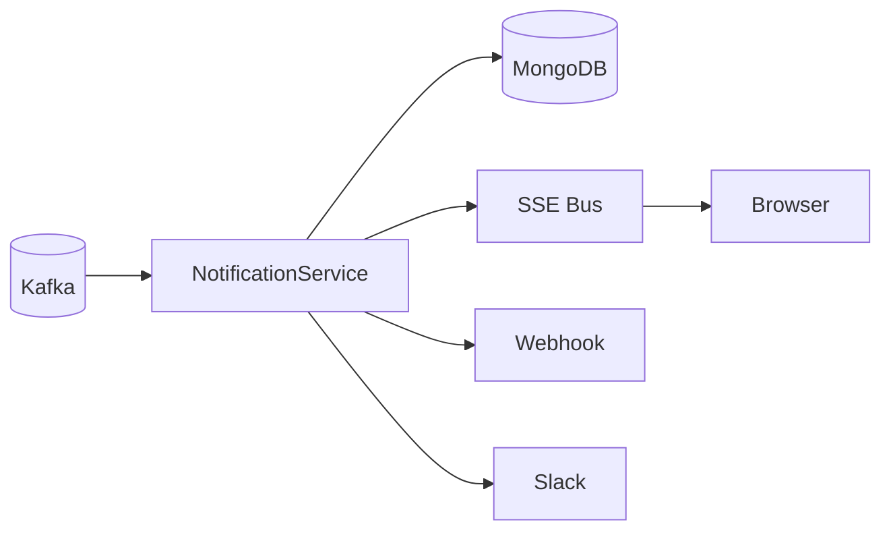

# Notifications

Notifications are producer-driven with minimal core fields. The notification system supports multiple channels (in-app,
webhook, Slack) with throttling, retries, and user subscription preferences.

## Architecture



The NotificationService implements `LifecycleEnabled` and starts its Kafka consumer during application startup.
It subscribes to execution result events (`EXECUTION_COMPLETED`, `EXECUTION_FAILED`, `EXECUTION_TIMEOUT`) and
automatically creates notifications for users when their executions complete.

## Core fields

| Field      | Description                                                               |
|------------|---------------------------------------------------------------------------|
| `subject`  | Short title                                                               |
| `body`     | Text content                                                              |
| `channel`  | `in_app`, `webhook`, or `slack`                                           |
| `severity` | `low`, `medium`, `high`, or `urgent`                                      |
| `tags`     | List of strings for filtering, e.g. `["execution", "failed"]`             |
| `status`   | `pending`, `sending`, `delivered`, `failed`, `skipped`, `read`, `clicked` |

## Tag conventions

Producers include structured tags for filtering, UI actions, and correlation.

| Tag type  | Purpose                        | Examples                         |
|-----------|--------------------------------|----------------------------------|
| Category  | What the notification is about | `execution`                      |
| Entity    | Entity type                    | `entity:execution`               |
| Reference | Link to specific resource      | `exec:<execution_id>`            |
| Outcome   | What happened                  | `completed`, `failed`, `timeout` |

## Examples

Execution completed:

```json
["execution", "completed", "entity:execution", "exec:2c1b...e8"]
```

Execution failed:

```json
["execution", "failed", "entity:execution", "exec:2c1b...e8"]
```

## Throttling

The service throttles notifications per user per severity window:

```python
--8<-- "backend/app/services/notification_service.py:ThrottleCache"
```

## Channel handlers

Notifications route to handlers based on channel:

```python
--8<-- "backend/app/services/notification_service.py:channel_handlers"
```

In-app notifications publish to the SSE bus for realtime delivery. Webhook and Slack channels use HTTP POST with retry
logic.

## Subscription filtering

Users configure subscriptions per channel with severity and tag filters. The `_should_skip_notification` method checks
these before delivery:

```python
--8<-- "backend/app/services/notification_service.py:should_skip_notification"
```

## Key files

| File                                                                                                                                                       | Purpose                         |
|------------------------------------------------------------------------------------------------------------------------------------------------------------|---------------------------------|
| [`services/notification_service.py`](https://github.com/HardMax71/Integr8sCode/blob/main/backend/app/services/notification_service.py)                     | Notification delivery and logic |
| [`db/docs/notification.py`](https://github.com/HardMax71/Integr8sCode/blob/main/backend/app/db/docs/notification.py)                                       | MongoDB document models         |
| [`db/repositories/notification_repository.py`](https://github.com/HardMax71/Integr8sCode/blob/main/backend/app/db/repositories/notification_repository.py) | Database operations             |
