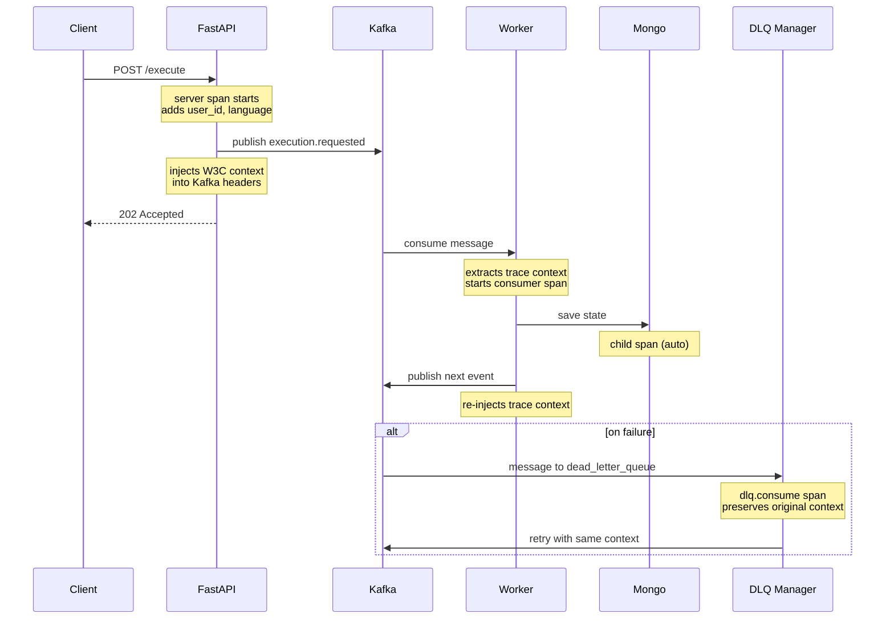

# Tracing

This backend uses OpenTelemetry to record traces across the main request and event flows so you can answer the two practical questions that matter when something is slow or failing: what happened in which order, and where did the time go.

## How it's wired

Initialization happens once during application startup. The lifespan hook (app/core/dishka_lifespan.py) calls init_tracing to configure the tracer provider (service name/version, resource attributes, sampler) and to instrument FastAPI, HTTPX, PyMongo and logging. This creates server spans for incoming HTTP requests, client spans for outgoing HTTP requests, and DB spans for Mongo calls. The same init call is used by the background workers so traces are coherent everywhere.

The tracer is a global shared component; spans are created as needed without explicit start/stop in the request path.

## What's recorded

### HTTP requests

FastAPI auto-instrumentation creates a span per request. In selected endpoints a few domain attributes are added so the span includes the user id, execution language and client address.

### Kafka publishes

The event publisher (KafkaEventService) adds headers to each message. Besides a few readable headers (event_type, correlation_id, service) it injects the W3C trace context (traceparent/tracestate). That makes the trace transferable to consumers without coupling to any specific SDK.

### Kafka consumes

Two layers capture consumption. The generic consumer (`events/core/consumer.py`) extracts the W3C context from Kafka headers and starts a consumer span before dispatching the typed event. The DLQ manager (`app/dlq/manager.py`) does the same for dead-letter messages and for retry produces it re-injects the current trace context into the new Kafka headers. You can click from a request that published an event to the consumer that processed it, and from a failed message in DLQ to its original producer.

### Event persistence

The event repository and event store add lightweight attributes to the current span (event id/type, execution id, batch size). DB operations themselves are already traced by the Mongo instrumentation, so timings are available even when these helpers are not present.

### Notifications

When sending webhooks or Slack messages, the current span is annotated with the notification id and channel. HTTPX auto-instrumentation records the outbound call duration and status, so you see exactly which webhook is slow or failing.

### Rate limits

After a rate-limit check the decision (allowed, limit, remaining, algorithm) is attached to the span. If a request is rejected, the span shows the effective rule in one place.

## Execution trace example

The client hits `POST /execute` and FastAPI creates a server span. The handler adds attributes like execution.language, script length and user id. The service publishes an `execution.requested` event and the producer puts the W3C context into Kafka headers. That publish runs inside the server span, so the new consumer span becomes a child rather than an unrelated trace.

The worker consumes the message, extracts the trace context from headers, and starts a consumer span with the event id/type and Kafka topic/partition/offset attributes. Any DB calls the worker makes via Mongo appear as child spans automatically. If the worker produces another event, it injects the current trace context again, and the subsequent consumer continues the same trace.

If the message fails and lands in the DLQ, the DLQ manager still sees the original trace context and records a `dlq.consume` span when it handles the message. When it retries, the retry produces carry the same context forward so you can see the whole path across failures and retries.

## Practical use

When an endpoint is slow, open the request span and look at the child spans. You'll see if the time is in rate-limit checks, Mongo, Kafka publishing, or downstream webhooks. When a message fails, open the `dlq.consume` span for the message and follow the links back to the original request and the producer that created it. When you want to understand load, browse traces by endpoint or topic — the spans include batch sizes, message sizes (from Kafka instrumentation), and DB timings, so you can quickly spot hot spots without adding print statements.

For local development, point the app at a Jaeger all-in-one or an OpenTelemetry Collector that forwards to Jaeger. With the docker-compose setup, Jaeger typically exposes a UI at `http://localhost:16686`. Open it, select the service (for example integr8scode-backend, dlq-processor, event-replay, or saga-orchestrator), and find traces. You should see the HTTP server spans, kafka.consume spans on workers, MongoDB spans, replay and saga spans, and notification outbound calls under the same trace.

Tracing is sampled. If you don't set an endpoint for the OTLP exporter the SDK drops spans after local processing; if you do set one (e.g. an OTel Collector, Tempo, or Jaeger) you get full traces in your backend. The sampler can be ratio-based or adaptive; both are supported. If you don't care about traces in a particular environment, set `OTEL_SDK_DISABLED=true` or set the sampling rate to 0.

## Design choices

The tracing helpers are minimal. No try/except wrappers around every call, no getattr/hasattr gymnastics and no explicit casts. The few places code is added are small, readable and match the surrounding style: either a span is started with attributes or attributes are added to the current span. Kafka context propagation uses the standard W3C keys so any consumer — ours or another service — can continue the trace without a shared library.
