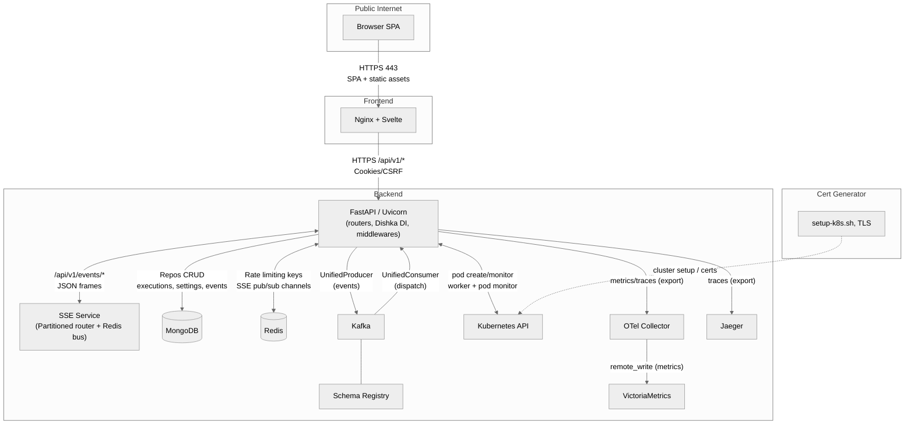
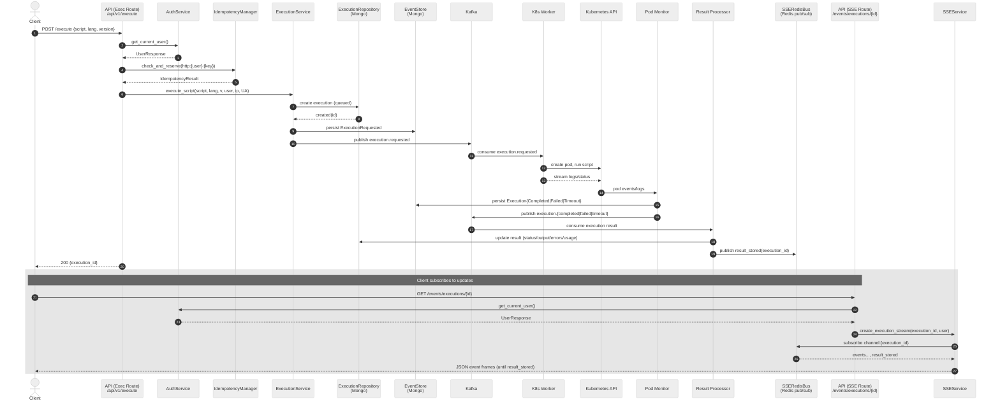
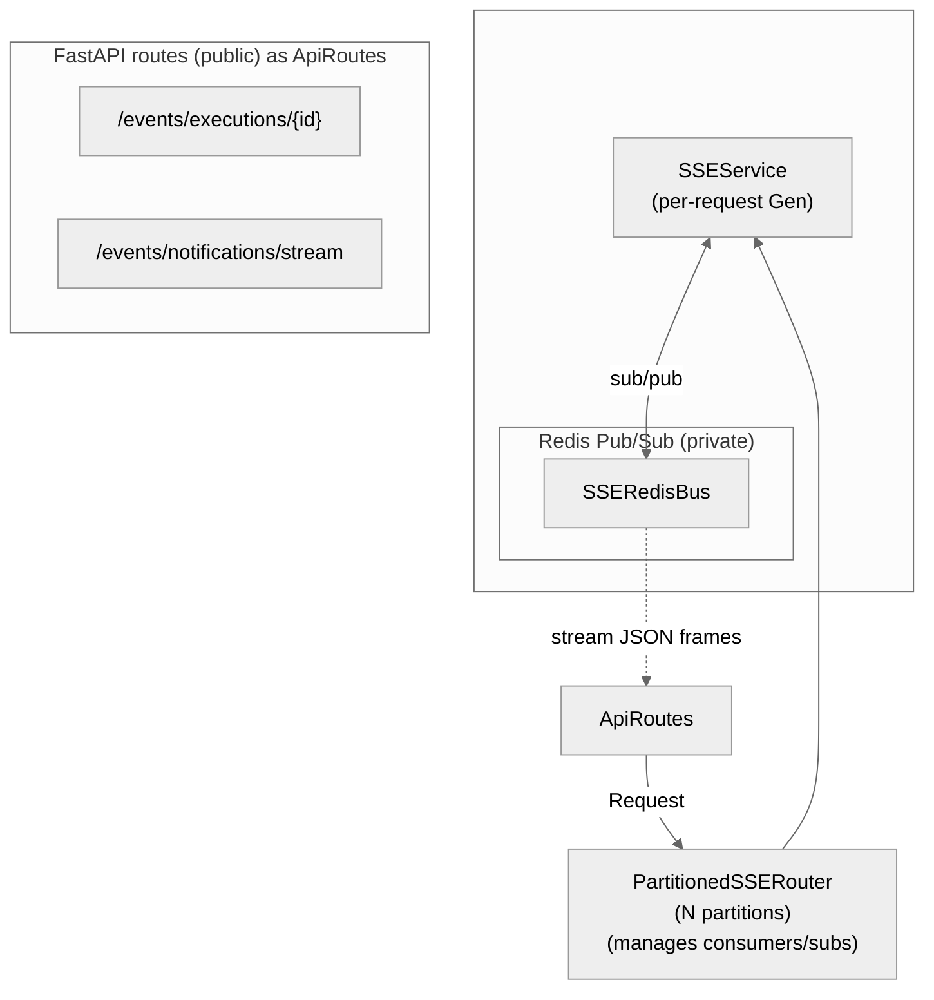
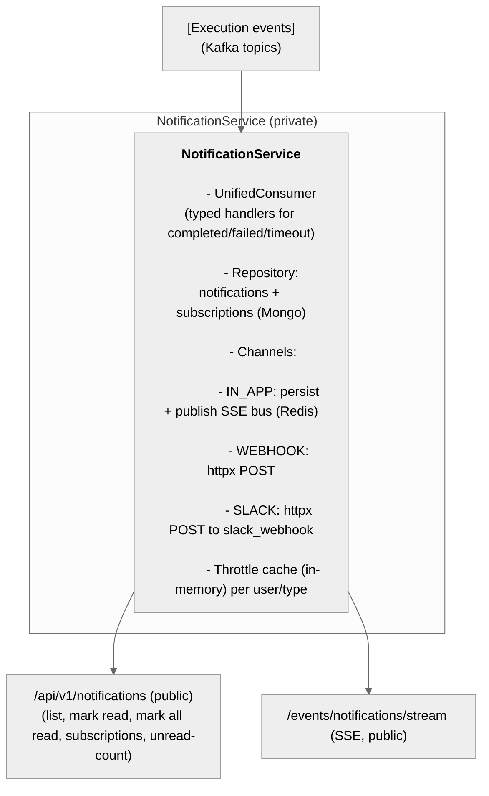

# Architecture overview

This document sketches the system as it actually exists in this repo, using ASCII block diagrams. Each diagram includes labeled arrows (protocols, topics, APIs) and marks public vs private surfaces. Short captions (1–3 sentences) follow each diagram.


## Top-level system (containers/services)



Frontend serves the SPA; the SPA calls FastAPI over HTTPS. Backend exposes REST + SSE; Mongo persists state, Redis backs rate limiting and the SSE bus, Kafka carries domain events (with schema registry), and Kubernetes runs/monitors execution pods.


## Backend composition (app/main.py wiring)

```mermaid
%%{init: {'theme': 'neutral'}}%%
graph TD
    subgraph "Backend (FastAPI app)"
        direction TB
        B0("Backend (FastAPI app)")

        subgraph "Middlewares"
            B1("Middlewares")
            M1("CorrelationMiddleware (request ID)")
            M2("RequestSizeLimitMiddleware")
            M3("CacheControlMiddleware")
            M4("OTel Metrics (setup_metrics)")
        end

        subgraph "Routers (public)"
            B2("Routers (public)")
            R1("/auth")
            R2("/execute")
            R2_1("/result/{id}, /executions/{id}/events")
            R2_2("/user/executions, /example-scripts, /k8s-limits")
            R2_3("/{execution_id}/cancel, /{execution_id}/retry, DELETE /{execution_id}")
            R3("/scripts")
            R4("/replay")
            R5("/health")
            R6("/dlq")
            R7("/events")
            R8("/events (SSE)")
            R8_1("/events/notifications/stream")
            R8_2("/events/executions/{id}")
            R9("/notifications")
            R10("/saga")
            R11("/user/settings")
            R12("/admin/users")
            R13("/admin/events")
            R14("/admin/settings")
            R15("/alerts")
        end

        subgraph "DI & Providers (Dishka)"
            B3("DI & Providers (Dishka)")
            D1("Container")
            D2("Exception handlers")
        end

        subgraph "Services (private)"
            B4("Services (private)")
            S1("ExecutionService")
            S2("KafkaEventService")
            S3("EventService")
            S4("IdempotencyManager")
            S5("SSEService")
            S6("NotificationService")
            S7("UserSettingsService")
            S8("SavedScriptService")
            S9("RateLimitService")
            S10("ReplayService")
            S11("SagaService")
            S12("K8s Worker")
            S13("Pod Monitor")
            S14("Result Processor")
            S15("Coordinator")
            S16("EventBusManager")
        end
        
        subgraph "Repositories (Mongo, private)"
            B5("Repositories (Mongo, private)")
            DB1("ExecutionRepository")
            DB2("EventRepository")
            DB3("NotificationRepository")
            DB4("UserRepository")
            DB5("UserSettingsRepository")
            DB6("SavedScriptRepository")
            DB7("SagaRepository")
            DB8("ReplayRepository")
            DB9("IdempotencyRepository")
            DB10("SSERepository")
            DB11("ResourceAllocationRepository")
            DB12("Admin repositories")
        end

        subgraph "Events (Kafka plumbing)"
            B6("Events (Kafka plumbing)")
            E1("UnifiedProducer, UnifiedConsumer, EventDispatcher")
            E2("EventStore")
            E3("SchemaRegistryManager")
            E4("Topics mapping")
            E5("Event models")
        end

        subgraph "Mappers (API/domain)"
            B7("Mappers (API/domain)")
            MAP1("execution_api_mapper, saved_script_api_mapper, ...")
            MAP2("notification_api_mapper, saga_mapper, replay_api_mapper, ...")
            MAP3("admin_mapper, admin_overview_api_mapper, ...")
        end
        
        subgraph "Domain"
            B8("Domain")
            DOM1("Enums")
            DOM2("Models")
            DOM3("Admin models")
        end
        
        subgraph "External dependencies (private)"
            B9("External dependencies (private)")
            EXT1("MongoDB (db)")
            EXT2("Redis (rate limit, SSE bus)")
            EXT3("Kafka + Schema Registry")
            EXT4("Kubernetes API (pods)")
            EXT5("OTel Collector + VictoriaMetrics (metrics)")
            EXT6("Jaeger (traces)")
        end
        
        subgraph "Settings"
            B10("Settings (app/settings.py)")
            SET1("Runtimes/limits, Kafka/Redis/Mongo endpoints, ...")
        end
    end
    
    B0 --> B1 & B2 & B3 & B4 & B5 & B6 & B7 & B8 & B9 & B10
    
    B1 --> M1 & M2 & M3 & M4
    
    B2 --> R1 & R2 & R3 & R4 & R5 & R6 & R7 & R8 & R9 & R10 & R11 & R12 & R13 & R14 & R15
    R2 --> R2_1 & R2_2 & R2_3
    R8 --> R8_1 & R8_2
    
    B3 --> D1 & D2
    
    B4 --> S1 & S2 & S3 & S4 & S5 & S6 & S7 & S8 & S9 & S10 & S11 & S12 & S13 & S14 & S15 & S16

    B5 --> DB1 & DB2 & DB3 & DB4 & DB5 & DB6 & DB7 & DB8 & DB9 & DB10 & DB11 & DB12

    B6 --> E1 & E2 & E3 & E4 & E5

    B7 --> MAP1 & MAP2 & MAP3
    
    B8 --> DOM1 & DOM2 & DOM3

    B9 --> EXT1 & EXT2 & EXT3 & EXT4 & EXT5 & EXT6
    
    B10 --> SET1
```



This outlines backend internals: public routers, DI and services, repositories, event stack, and external dependencies, grounded in the actual modules and paths.


## HTTP request path (representative)

```
Browser (SPA) --HTTPS--> FastAPI Router --DI--> Service --Repo--> MongoDB
                                       \--DI--> Service --Redis--> rate limit (keys)
                                       \--DI--> KafkaEventService --Kafka--> topic
                                       \--SSE-> SSEService --Redis pub/sub--> broadcast
```

Routers resolve dependencies via Dishka and call services. Services talk to Mongo, Redis, Kafka based on the route; SSE streams push via Redis bus to all workers.


## Execution lifecycle (request -> result -> SSE)



Execution is event-driven end-to-end. The request records an execution and emits events; workers and the pod monitor complete it; the result is persisted and the SSE stream closes on result_stored.


## SSE architecture (execution and notifications)



All app workers publish/consume via Redis so SSE works across processes; streams end on result_stored (executions) and on client close or shutdown (notifications).


## Saga orchestration (execution_saga)


Sagas use explicit DI (no context-based injection). Only serializable public data is persisted; runtime objects are not stored.


## Notifications (in-app, webhook, Slack, SSE)



NotificationService processes execution events; in-app notifications are stored and streamed to users; webhooks/Slack are sent via httpx.


## Rate limiting (dependency + Redis)

```
 [Any router] --Depends(check_rate_limit)--> check_rate_limit (DI)
        |                                    |
        |                                    |-- resolve user (optional) -> identifier (user_id or ip:...)
        |                                    |-- RateLimitService.check_rate_limit(...)
        |                                    |      Redis keys: rate_limit:*  (window/token-bucket)
        |                                    |-- set X-RateLimit-* headers on request.state
        |                                    |-- raise 429 with headers when denied
        v                                    v
   handler continues or fails           Redis (private)
```

Anonymous users are limited by IP with a 0.5 multiplier; authenticated users by user_id. Admin UI surfaces per-user config and usage.


## Replay (events)

```
  /api/v1/replay/sessions (admin) --> ReplayService
         |                               |
         |                               |-- ReplayRepository (Mongo) for sessions
         |                               |-- EventStore queries filters/time ranges
         |                               |-- UnifiedProducer to Kafka (target topic)
         v                               v
    JSON summaries                    Kafka topics (private)
```

Replay builds a session from filters and re-emits historical events to Kafka; API exposes session lifecycle and progress.


## Saved scripts & user settings (event-sourced settings)

```
 /api/v1/scripts/*  -> SavedScriptService -> SavedScriptRepository (Mongo)

 /api/v1/user/settings/* -> UserSettingsService
        |-- UserSettingsRepository (snapshot + events in Mongo)
        |-- KafkaEventService (USER_* events) to EventStore/Kafka
        |-- Cache (LRU) in process
```

Saved scripts are simple CRUD per user. User settings are reconstructed from snapshots plus events, with periodic snapshotting.


## DLQ and admin tooling

```
  Kafka DLQ topic <-> DLQ manager (retry/backoff, thresholds)
  /api/v1/admin/events/* -> admin repos (Mongo) for events query/delete
  /api/v1/admin/users/* -> users repo (Mongo) + rate limit config
  /api/v1/admin/settings/* -> system settings (Mongo)
```

Dead letter queue management, events/query cleanup, and admin user/rate-limit endpoints are exposed under /api/v1/admin/* for admins.


## Frontend to backend paths (selected)

```
Svelte routes/components -> API calls:
  - POST /api/v1/auth/register|login|logout
  - POST /api/v1/execute, GET /api/v1/result/{id}
  - GET /api/v1/events/executions/{id}  (SSE)
  - GET /api/v1/notifications, PUT /api/v1/notifications/{id}/read
  - GET /api/v1/events/notifications/stream (SSE)
  - GET/PUT /api/v1/user/settings/*
  - GET/PUT /api/v1/notifications/subscriptions/*
  - GET/POST /api/v1/replay/* (admin)
  - GET/PUT /api/v1/admin/users/* (admin rate limits)
```

SPA uses fetch and EventSource to the backend; authentication is cookie-based and used on SSE via withCredentials.


## Topics and schemas (Kafka)

```
infrastructure/kafka/events/* : Pydantic event models
infrastructure/kafka/mappings.py: event -> topic mapping
events/schema/schema_registry.py: schema manager
events/core/{producer,consumer,dispatcher}.py: unified Kafka plumbing
```

Typed events for executions, notifications, saga, system, user, and pod are produced and consumed via UnifiedProducer/Consumer; topics are mapped centrally.


## Public vs private surfaces (legend)

```
Public to users:
  - HTTPS REST: /api/v1/* (all routers listed above)
  - HTTPS SSE:  /api/v1/events/*

Private/internal only:
  - MongoDB (all repositories)
  - Redis (rate limiting keys, SSE bus channels)
  - Kafka & schema registry (events)
  - Kubernetes API (pod build/run/monitor)
  - Background tasks (consumers, monitors, result processor)
```

Only REST and SSE endpoints are part of the public surface; everything else is behind the backend.
